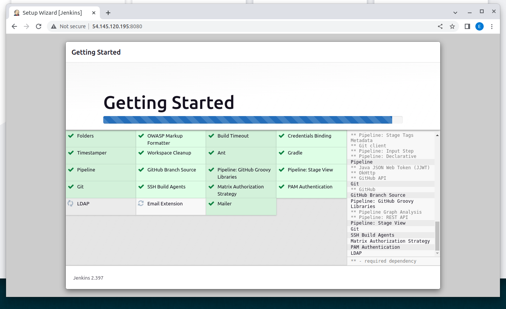
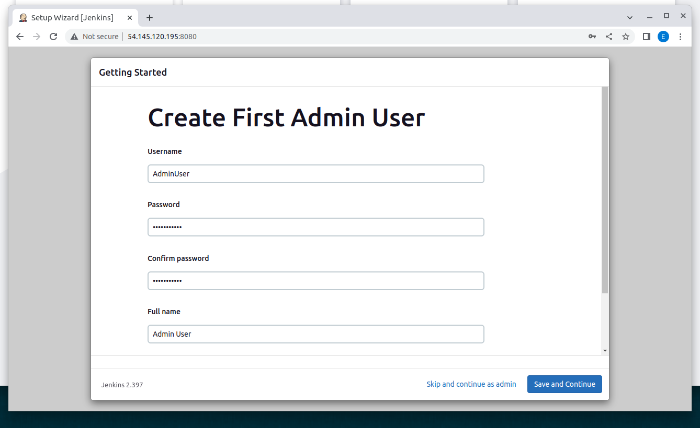
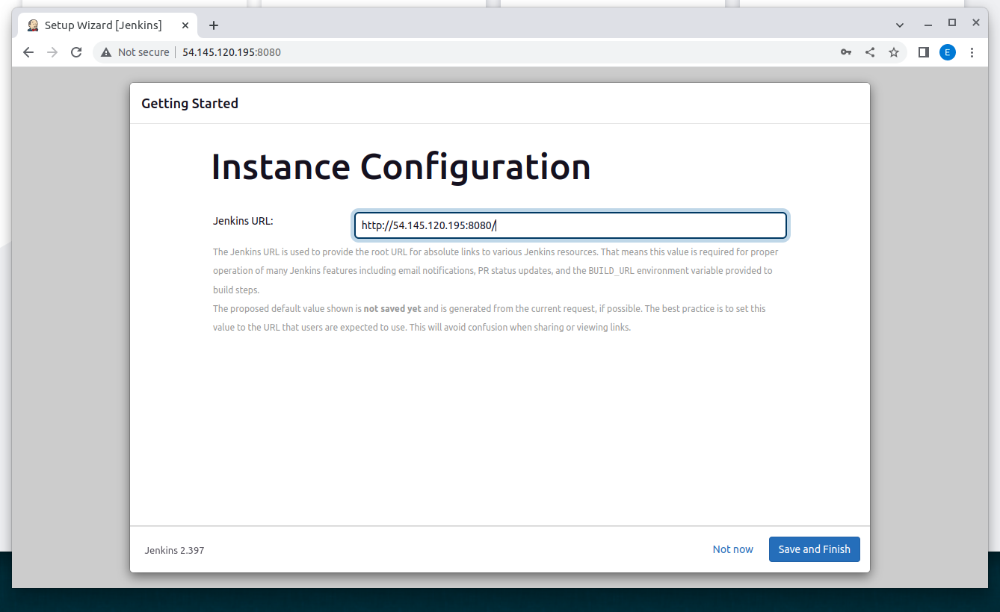
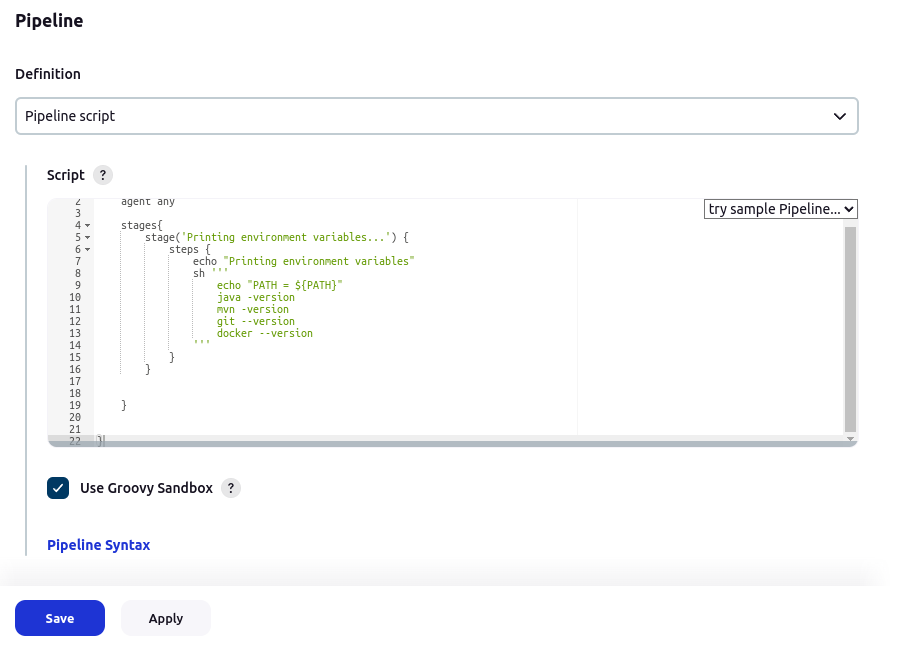
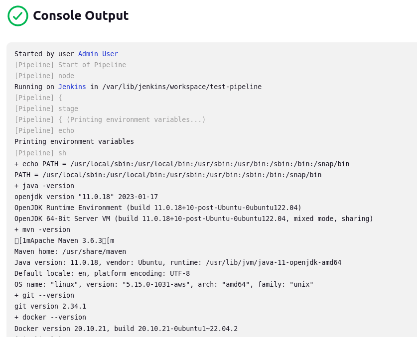

JENKINS WITH AWS EC2
-----------------------------------------------------------

Installing Jenkins in an AWS EC2 instance.

-----------------------------------------------------------

**Security group**

A security group that allows to communicate with ports 22
and 8080 is created.


Also, a key pair is needed, so we can install Jenkins
in an EC2 instance using the command line.

-----------------------------------------------------------

**AWS EC2 instance**

An EC2 instance that runs Ubuntu 22 is created.


-----------------------------------------------------------

**Installing Java, Maven, Docker and Jenkins**

**Java 11**

```

sudo apt-get update
sudo apt install openjdk-11-jdk -y

```

**Maven**

```

sudo apt-get update
sudo apt-get -y install maven

```

**Docker**

```

sudo apt-get update
sudo apt install docker.io

```

Add ubuntu user to the docker group:

```

sudo groupadd docker
sudo usermod -aG docker $USER

```

Then, log out and log back and try to run this:

```

docker run hello-world

```

**Jenkins**

Take a look at this URL before installing Jenkins with apt-get:

https://www.jenkins.io/blog/2023/03/27/repository-signing-keys-changing/

```

sudo apt update
sudo apt install jenkins -y

```

Then verify if Jenkins started successfully:

```

sudo systemctl status jenkins

```

-----------------------------------------------------------

**Configuring Jenkins**

Unlock Jenkins:


Customize Jenkins:


Installing plugins:



New admin user:



Instance configuration:



Jenkins is ready:


-----------------------------------------------------------

**Pipeline example**

A small test pipeline is created to verify if Java, Maven, Git and Docker were installed successfully:






-----------------------------------------------------------