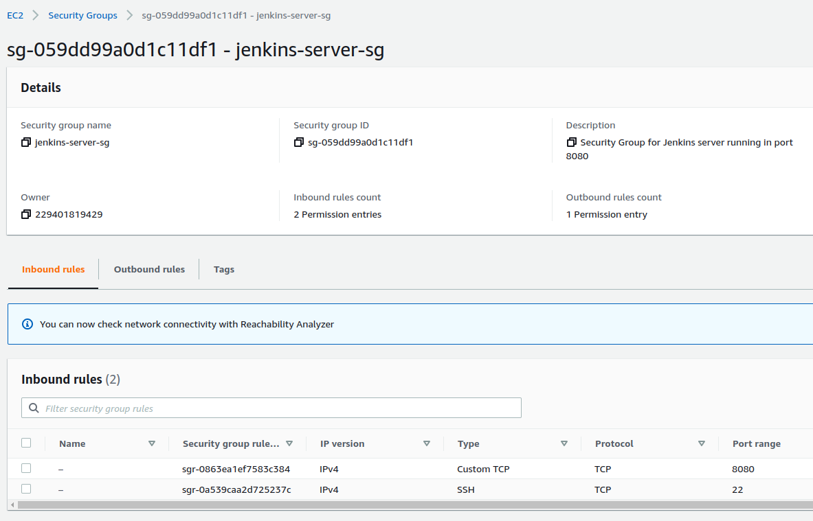

JENKINS WITH AWS EC2
-----------------------------------------------------------

Installing Jenkins with AWS EC2.

-----------------------------------------------------------

**Security group**

A security group that allows to communicate with ports 22
and 8080 is created.

Also, a key pair is needed, so we can install Jenkins
in an EC2 instance using the command line.

-----------------------------------------------------------

**AWS EC2 instance**

An EC2 instance that runs Ubuntu 22 is created.

-----------------------------------------------------------