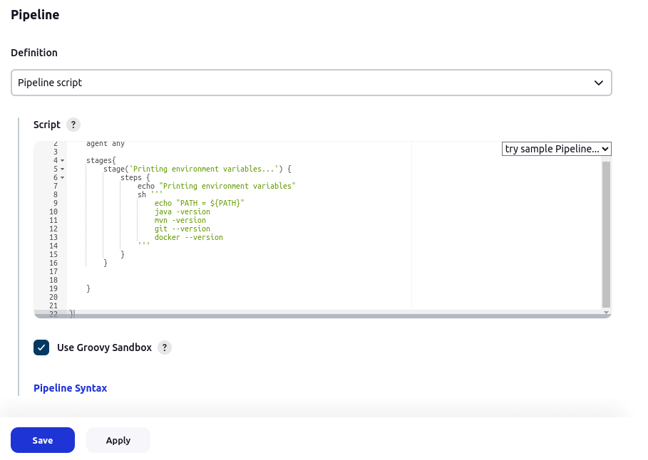
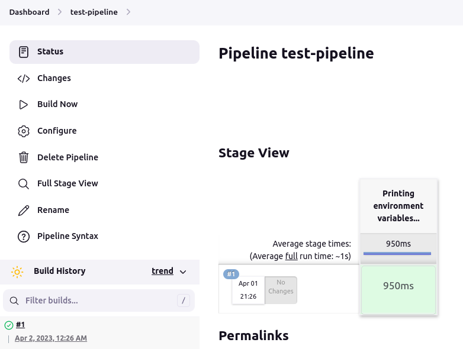
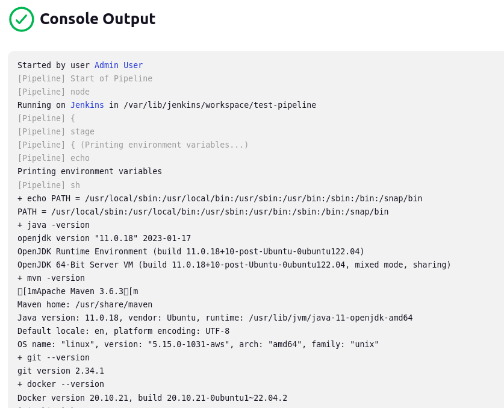

**Pipeline example**

-----------------------------------------------------------

A small test pipeline is created to verify if Java, Maven, Git and Docker were installed successfully:

-----------------------------------------------------------