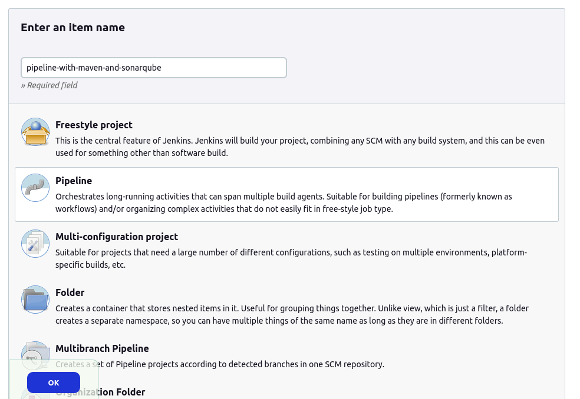
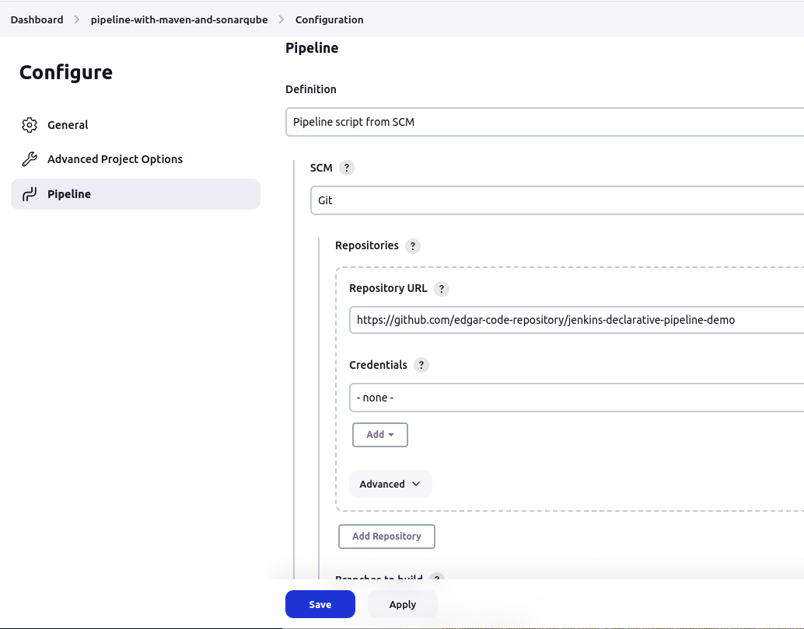
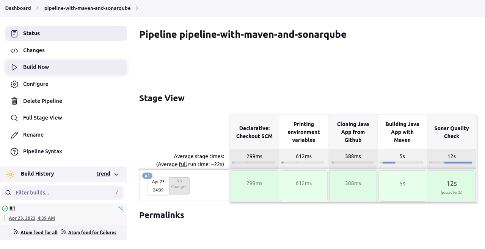
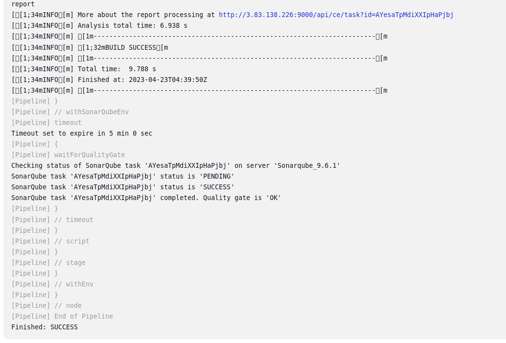
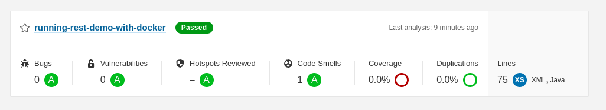

**Pipeline with Git, Maven and Sonarqube**

----------------------------------------------------------------------

Pipeline created using a Jenkinsfile located in this Github repo:

https://github.com/edgar-code-repository/jenkins-declarative-pipeline-demo

----------------------------------------------------------------------

**Creating a pipeline:**

----------------------------------------------------------------------

**Configuring Jenkins file in Github repo:**

----------------------------------------------------------------------

**Running pipeline:**

----------------------------------------------------------------------

**Console log:**

----------------------------------------------------------------------

**Sonarqube status:**

----------------------------------------------------------------------