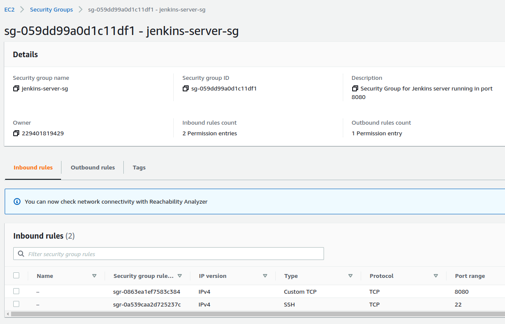

**Security group**

-----------------------------------------------------------

A security group that allows to communicate with ports 22
and 8080 is created.

Also, a key pair is needed, so we can install Jenkins
in an EC2 instance using the command line.

-----------------------------------------------------------